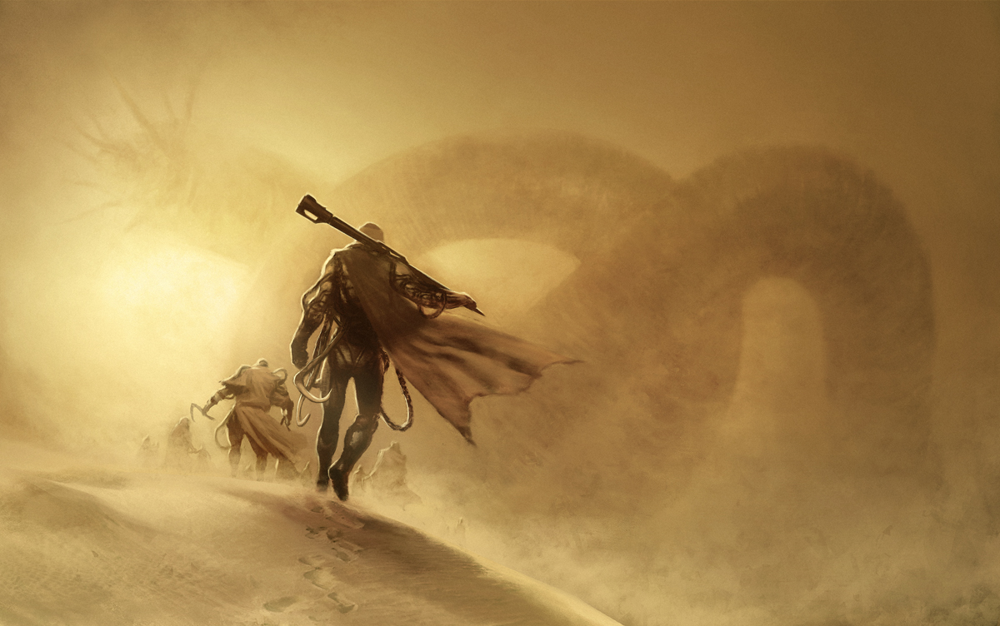

# Bones

## #100DaysofStory: 001

### Friday, June 14, 2019

---

Visual Inspiration: Unknown

Musical Inspiration:

- Be Svendsen - [Bones](https://open.spotify.com/track/44PS8lB5MuUKnqMnmtZWX6)
- Be Svendsen - [Bones (Bwoy De Bhajans Klovborg Remix)](https://open.spotify.com/track/5DIvDefES3gfvsLSRLVyMD)

---

## Bones

There are bones in the road.

This road has been trod before. Many times before; by many different people. Many different types of people.

Some, may not be people at all—maybe not _human_ at all.

"Still..." Torlan thought aloud to himself and anyone else who may be listening, "Bones are a good sign. Something is alive—or was alive."

Torlan had been on the dusty, dry road for as long as he could remember. How far back could he remember?

His mind didn't seem to have the capacity for hindsight.

"I haven't been here my entire life," He thought, not for the first time. His mouth automatically formed the words, making the sound which those thoughts took in the physical realm.

He sipped liquid from a tube that reached over his left shoulder.

Torlan found some amount of a strange comfort in the fact that he knew he would not have survived out here long enough to grow to full strength. He also knew if he tried to remember what actually came before the road, he would find nothing but disappointment—worse than dissapointment, in fact. A void stretched out behind him. He could not turn around or risk being lost in it.

---- ∫ ----

_There are bones in the road._

There were beings on this road before me.

Any semblance of a consistent thread of thought blew away with a new breeze that swept over the road, tossing grains of sand at him.

The sip of water Torlan had consumed—what was it, minutes...hours ago?

"A minute, if that."

He only had to think hard enough to understand basic facts about his situation.

The water felt as if it were dripping down his throat; his stomache. Therefore, he knew that it must have not been more than a minute since he took that drink.

_Shit_...Torlan thought, this time without his mouth opening. If he had taken in enough water to feel it so distinctly, he could reason two possible scenarios:

_One: I accidentally took in too much water._

_Two: I am more dehydrated than I thought._

He walked on the road. He traveled over bones. _This road has a history._

---- ∫ ----

Torlan wandered on down the road. He was being led to something, he knew. How he knew, he worried not. A carefree traveler _does_ still have a history, whether or not he carries it with him.

Everything has a history, even if it is never considered. Each one of the bones has its own history. Torlan wondered not about the them—why or how they got there.

Torlan noticed that he actually was getting somewhere. Small dunes paralleled the road to his left, stretching into the distance until being lost in the haze near the horizon. 

Each mound of the offwhite sand was indistinguishable from the next, particularly when no one is paying them much attention. Torlan felt a new thought bump up to against the edge of his consciousness, his mouth half-forming the half-forgotten question.

His attention was on the bones, however, forcing all other thoughts out into the haze of his subconscious. Some of the bones on which he walked were easily as long as he was tall.

There are bones in the road. They hadn't always been this size...

_...had they?_

---- ∫ ----

He watched one bone in particular, as thick around as his waist, from when it first appeared out of the dusty haze until he he stepped over it. It was curved slightly upward, causing a section of one end to jut out of the loose almost-white sand next to the road.

Torlan noticed that he'd stopped walking. He was standing on the packed sand directly on top of where he imagined the bone would intersect the road.

His ears still expected to hear the sound of his footsteps; his consistent breath, in and out; the occasional creak of something in his pack; a scrape as two external surfaces of his exosuit rubbed against one another. Now, he could hear the sand, seemingly able to pick out the faint clicking of individual grains as they shifted with the wind.

The sudden change in sonic scenery made his scalp tingle, starting from directly behind each of his ears and spreading to his forehead. A spattering of knock-knock sounds came from the direction of the the bit of bone protruding from the sand's surface as the larger sand particles struck it.

"How far does it go?" Torlan wondered out loud, the sound of his voice turning the scalp-tingle into a shiver that ran down his spine. 

His eyes refocused on the dunes a few hundred meters beyond the point of the immense bone. Their shape looked oddly like the spine of some enormous creature laying buried under a thin layer of the light-colored sand.

The shiver lingered for a few seconds, the hairs on the back of his neck and arms would've raised had they not been covered by the protective envelope of his suit. That thought gave him some comfort.

As Torlan dropped his gaze to the road under his feet and the bones buried below, he let out the lung-full of air he hadn't noticed he'd been holding.

_Held since..._

_...since...?_

_...since...I stopped?_

The breeze was picking up, he noticed, his eyes tracing the line in the sand in front of him until it melded with the undefined horizon.

---- ∫ ----

He continued along the road. There are bones in the road.

Larger and larger pieces of bone—more frequent, too.

Torlan began to pick out a pattern. They were more frequent and more regular than before. The dual primary stars danced their way toward the dunes; the shadows cast by the now-towering dual lines of bones stretched across the surface of the road.

Bones on either side of him were standing taller than the tip of his visor, slowly enclosing him in.

His eyes fixed on a large patch of sunlight hitting the road in front of him. Once again he watched it approach until he was looking at his boots standing in a settling cloud of dust.

He looked up slowly. He found himself looking through a hole in the wall; a wall of bone. A number of consecutive bones—ribs—had been broken off at about chest-level, creating a sort of window. The broken pieces laying half-covered by sand of a similar color.

"Convenient."

He leaning his elbows against the sill of the window to watch the suns set over the dunes.

The last rays disappeared behind the darkening mounds of sand. Now that he spent some time looking at the dunes, they also seemed too regular; too indistinguishable from one another.

He heard something then—a steady, drawn out rumbling almost too low for his ears to pick up. It grew in strength.

He could feel it. His chest cavity reverberated with the vibrations.

The sound died down, following the fading light into nothingness.

_It gets dark here_ really _fast..._

He began to push off from the window sill to walk on, away from the strangeness of that moment. He had been looking down the tunnel as the last of the light and sound faded, and when he gazed through the window one last time...

_...something isn't right._

_I'd swear there were dunes just over there before..._

"...the suns set..."

His voice trailed off....

A slightly confused expression faded from his dark features.

Torlan closed his mouth, turned to face the waiting road, drew in a deep breath through the filters in his nostrils, and walked.

---- ∫ ----
