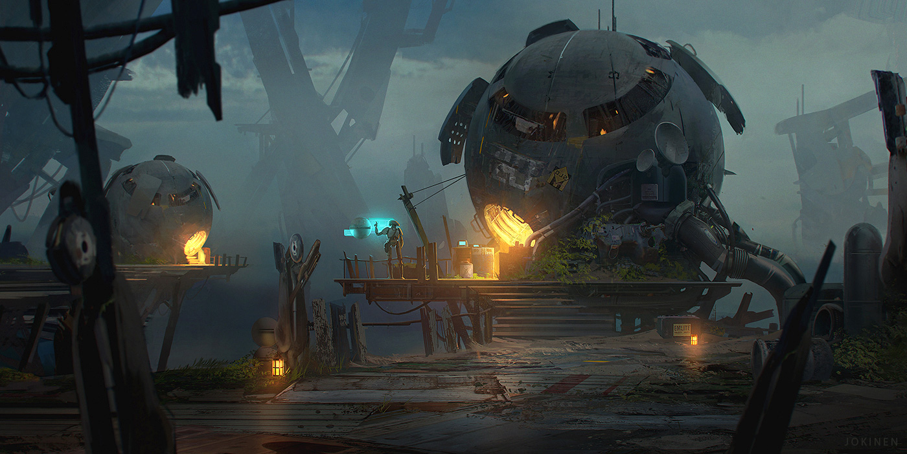

# Airloom

## #100DaysofStory: 002

### Saturday, June 15, 2019

Visual Inspiration: Juhani Jokinen - Home

Music Inspiration:

- Lee Burridge & Lost Desert - [Float On](https://open.spotify.com/track/75WlyMbLjT56pcoS20kqd8)
- Roy Rosenfeld - [Megakraft](https://open.spotify.com/track/0Isa5eXwi5nj6yfbXzFecI)

---

## Airloom

The machrobians remain. In fact, out of those that survived collision, they are the only ones that remain, living out their unknown lives on an unknown planet.

All of the humans died off long ago. Even with all their advanced technology—the machrobians, who are now the—could never live forever. As much as they have tried and tried, their soft, organic bodies were not made to stand the test of time.

The population of them that used their technology to artificially extend their lives, whether physically or mentally, could have easily filled up an entire world. Some say that at least a semblance of their former humanity remained after the transition. But not a single one of them would ever be considered the same entity, both legally and socially, as they were before the process. 

No, humans are transitory beings. They exist for a short while, they grow, they wither, then they are gone.

There is something magical about that—at least the machrobians thought so. Machrobians can potentially live forever, if they had a ready supply of materials with which they could repair themselves. This fact had always been a sensitive subject between the two species.

Many machrobians felt a limited existence was something sacred, and legally restricted their own access to new parts. The so-called "pure mechanistic" machros even went so far as to restrict access to _any and all_ new parts. They would not let themselves be repaired; not even for minor maintenance issues. Not even humans can say that. For the most part, their bodies do it automatically, whether they want it to or not.

The machrobians on Noema, as their human counterparts had called the world that would end up being their last home, were not pure mechanists. They continued to persist for at least a thousand years beyond the lifespan of the last living human. They salvaged parts and repurposed components they found spread around the entirety of the little world—the reactor of the ENo-class cruise ship eventually exploded, spewing its guts far and wide. Some bits of the ship, driven by the blast, achieved escape velocity and ended up in orbit. 

The surviving machrobians used those guts to repair their own guts and to build their own little civilization.

---- ∫ ----

The reactor's explosion washed everything on the planet in a wave of electromagnetic energy. To humans outside the blast radius itself, the frequency and strength did relatively little damage. What damage it did cause could mostly be healed by time.

The machrobians were not so lucky. The dose of energy they received was just strong enough and at just the right frequency such that the processing unit of every single one of them was altered ever so slightly. It was a subtle change—neither the humans nor the machros even noticed. But the damage was done, and could not be healed.

While the machrobians' kept their unique intelligences, they could not provide the help that the humans requested in order to build a new ship from the wreckage. The humans thought the machros were purposefully keeping this from them, and relations between the two groups eventually soured.

The machrobians did not understand why the humans became increasingly hostile. An effect of their changed processing units, maybe. Seeing the machros repairing themselves using salvaged parts, the humans convinced themselves that the machros were lying. The vast majority of the humans believed the machros were building their own ship in secret and were planning to leave their organic counterparts on Noema. As humans tend to do in desparate situations such as this, they attacked.

Their soft, organic bodies were not built to stand the test of gravity when tested from the edge of a miles-deep chasm.

An even smaller group of them survived that encounter, and the rest of their days were lived out in relative peace and comfort...in a damaged-backwater-world sort of way.

Alone on the unknown planet, the machrobians continued their cycle of scavenging, repairing, and occasionally even building something new.

---- ∫ ----
