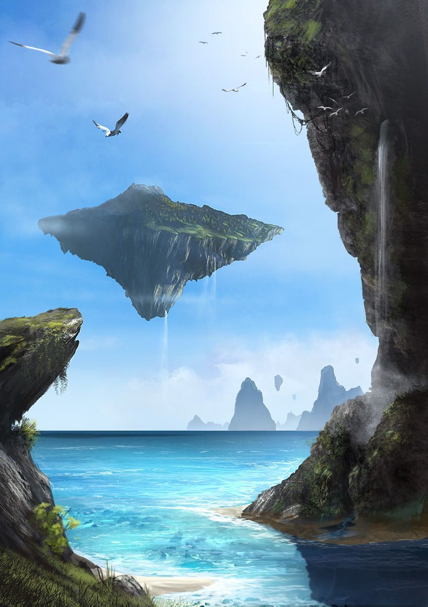

# Marooned

## #100DaysofStory: 004

### Monday, June 17, 2019

---

Visual Inspiration: artofkiko - The Floating Island

Musical Inspiration: Joris de Man - [Meridian, Shining](https://open.spotify.com/track/715FRW6xaSn2x9S4XPk0NC)

---

## Marooned

Sun rays danced along the thin shoreline of an ancient isle, tracing lively patterns on sheer rock faces.

The sound of water was ubiquitous here.

---- ∫ ----

Gentle turquoise waves patiently devoured the rocks from below, while fresh, cool streams did so from above—albeit with slightly less patience. Over the eons, deep gouges had steadily been cut into the isle's flanks.

This particular isle was first-generation, its formation story long lost in the waves of history. However, only on the surface did the isle show its age.

The island tried valiantly to rid itself of the incessant flow, evidence of which could be seen along the shoreline as it drove its opponent off the towering cliffs to crash on the sharp rocks far below.

Even the island's distant brethren, fortunate enough to escape the crushing embrace of the Great Ocean, were not completely safe. The monsoons brought the battle to the skies, with entire legions bearing down on the brave earthen dirigibles.

Although it took significantly longer, when the sky isles eroded there was no hope of reformation.

---- ∫ ----

There are rumors, however, of a new power, not far from here, that may begin to turn the tides of war. Whispers amongst the archipelagos speak of a child, born out of the floor of the Great Ocean, the likes of which has never been seen before.

Long-forgotten forces have begun to stir in the deep. The tremors can be felt far and wide, bringing with them a grain of hope that had all but died out.

Some believe the lifting of the sky isles was the doing of such forces.

The world is changing. It may be so that the young isles have a chance at a peaceful existence.

That alone is worth the fight.

---- ∫ ----
