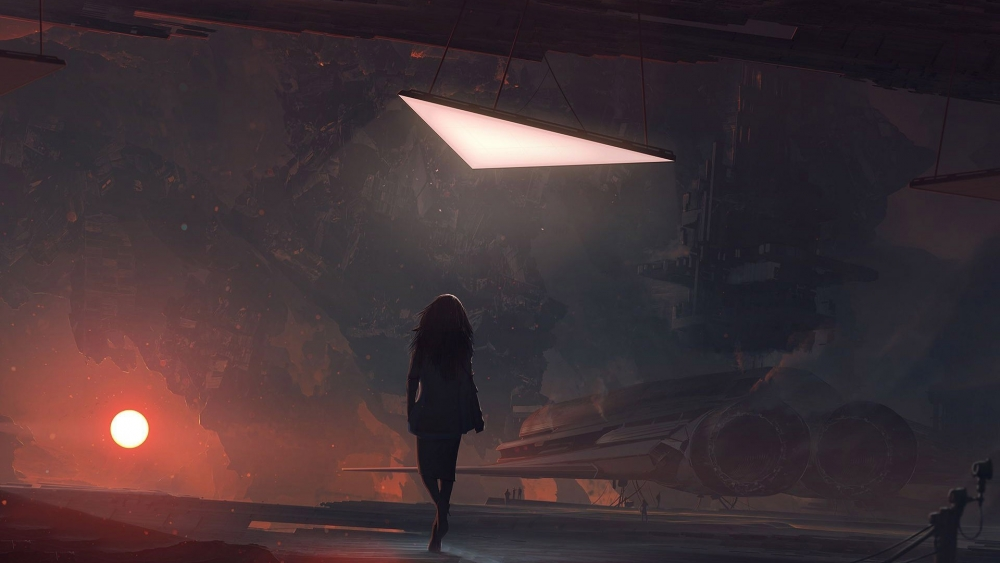

# Lossless

## #100DaysofStory: 005

### Tuesday, June 18, 2019

---

If you won't leave me  
Then I won't go  
If you can't see me  
Guess I'm a shadow

If I say sorry  
Would you let go?  

It's the only thing we know

If you don't need me  
Say it ain't so  
If you won't lead me  
Who will I follow?  

If I say sorry  
Would you come home?

It's the only thing we know

---

Visual Inspiration: Unknown

Musical Inspiration: Bob Moses - [The Only Thing We Know](https://open.spotify.com/track/6C4zZL5USMZ72bAFBytQeg)

---

## Lossless

_Will you accept that this is hopeless?_ Liala intoned

The rhythm of her tongue was slow, the notes somber and wistful. The language of her people vividly portrayed the emotions Liala was experiencing. It was too vivid; too much for Ira to bear.

_We have._

Ira's vision blurred as tears began to course down Ira's face, following the well-worn trails that had formed on her cheeks. 

Ira had fought for them. She had given them hope, hubris making her believe that she could lead them out from under the iron fist of Domari.

Their ignorance of their own plight them ran deeper than Ira could have understood, even if she had centuries to try. The Vana were the most beautiful species Ira had ever seen. She had experienced their exploitation first-hand for decades, but it was not until the fateful day when the extermines began to do their gruesome work that she was affected by it all.

She had spent those decades dispelling their ignorance, only to see it replaced by grief.

---- ∫ ----

The whine of the dual fusion reactors steadily grew in pitch and strength. Starting up the reactors was always a lengthy process after long periods of dormancy.

Ira could plainly see waves of wariness sweep across the faces of Vana standing or sitting nearby. A few of them occasionally turned their heads to watch the vessel with their eyes. They could not watch for long, as the searing disk of the Elaneva's star had become visible through the cave's entrance. Even Ira's eyes could not linger in that direction for very long before starting to smart.

The blizzard that had covered their escape from Daras was mostly gone now, the last flurries of snow wafting into the cave from the direction of the sun. As they entered the mouth of the hideout, the flakes turned into falling embers for a few brief moments, only to be extinguished as they hit the floor. 

The spark of hope that had kept her spirits up through the decades spent on Elaneva had also been extinguished.

Out of the group of her people she had brought to the ill-fated world, Ira was the only one left. Of the entire population of the majestic underground metropolis of Daras, the Vana she saw in front of her were likely the only ones left.

Ira knew this phase was over; there was nothing more to be done.

If she didn't let go, millions more would die—because of _her_.

She would've happily died to save the millions that perished in Daras.

---- ∫ ----

The Domari were ruthless, particularly when dealing with a valuable assets like Elaneva and the Alagevana people who inhabited it. This world and the handful of others like it were the lifeblood of Domari power and wealth.

_They'll do whatever it takes to keep that lifeblood flowing..._

The rising intensity of the fusion reactors was now putting butterflies in her stomach. Those reactors were the reason she was able to make the light-years-long crossing of the Well. 

There was always a certain electric excitement when she heard their warm-up routine. To have all of that power behind her—it was an intoxicating experience, particularly during the first few hours of flight when she could still use the nearby planets and stars as reference points.

The excitement bubbled, pushing against the internal walls she had thrown up to protect against the brain-deadening grief of the last few days.

She guessed that Domari were no strangers to extermination. In their grand scheme, losing a few cities of tens of millions each was not much of an issue, if it meant they retained their complete and utter dominance.

The ship entered the final stages of its preamble, the frequency of the reactors now too high for even the Vana to hear with their ears. A low-frequency resonance began, as Ira knew it would, oscillating slowly back and forth between the reactors. Her body suddered involuntarily as the vibrations reached her through air and rock, just as the shockwaves from the extermination mines had done a few days before.

Ira now understood something of the menace that Domari posed to every decent civilization in the galaxy. By themselves, her people would not make a dent in their defenses, and would likely be wiped out with one single retaliative strike.

That was why she had been sent with only a small group of Outside Agents. If the powers that be in Syn Domari somehow learned of their intentions, every citizen in the Proximate would be a target.

They had some terribly big guns. Worse yet, they did not hesitate to use them.

If allowed to continue, unchecked, on their current trajectory...

_How long until they are the most powerful force in the galaxy?_

_Then what happens?_

---- ∫ ----
