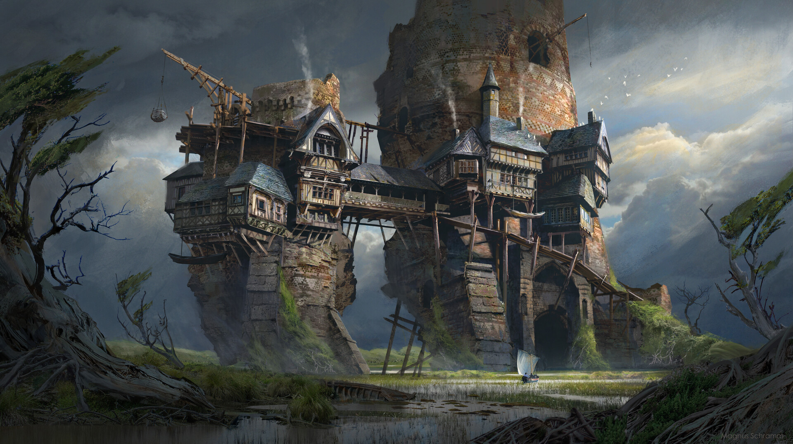

# Vantage

## #100DaysofStory: 007

### Thursday, June 20, 2019

---

Visual Inspiration: [Magnus Schram](https://www.artstation.com/mschm) - Swamp Outpost

Musical Inspiration: [Alon Mor - Los Recuerdos](https://open.spotify.com/track/3QJPLhERChpd0QEKOMl1p6)

---

## Vantage

The journey to get to the facility, including the reconnaissance once the facility was in range; entering the compound; obtaining the objective, whatever it turned out to be; and the escape from the compound—they were all part of the test. 

"Well _this_ is a new one."

The two figures crested the hilltop on armoured hands and knees, dropping to the ground once at the top to rest and take in the landscape below.

What they saw would have left anyone else sorely confused—as for them, they were only slightly bewildered. However, they had grown somewhat accustomed to being confronted with situations such as this—as accustomed as anyone _could_ grow to something like this. It was how they had turned such a significant profit over the last few years since retiring from Outside, where they had seen far more than their share of active battles.

The landscape they'd been trekking across, which was borderline desertous, ended abruptly at the bottom of the hill. They were now looking out over an expanse of swampy marshland between their vantage point—if that's what it could be called—and the mountains in the not-so-distance.

That was one of the stranger things about life on an orbital: when the world curves up and over your head instead of down below your feet—and out of sight—the concept of a vantage point can sometimes get confused. With a powerful enough lens, one could theoretically have line-of-sight to the rest of the world. Sometimes it felt like you're at the very bottom of the world, with everyone looking down on you; sometimes like you're at the top, able to look down on everyone else.

Either of those sensations could get particularly vivid on a ring as small as KG, though you did get used to it after a while.

---- ∫ ----

"Looks like we'll get to see first-hand how waterproof these bad boys are," he said after initiating their secure coms channel by touching the other man's suit with his own. This was a standard feature on just about every half-decent exosuit on the market.

They would maintain radio silence from now until they had a _very_ good reason to break it. With an opponent as capable as the one they faced, they could not take any chances. Even tightbeam light communication over short distances could potentially be traced and intercepted.

Over the last few hours of their walk, storm clouds began to brew over the ruins. It was obviously not a natural phenomena. The billowing clouds billowed up but stayed in place, directly on top of the ruins, shrouding them in darkness, rain, and the occasional lightning bolt for good measure.

It felt like the storm was showing off for any onlookers who happened to be looking on; for them.

---- ∫ ----
