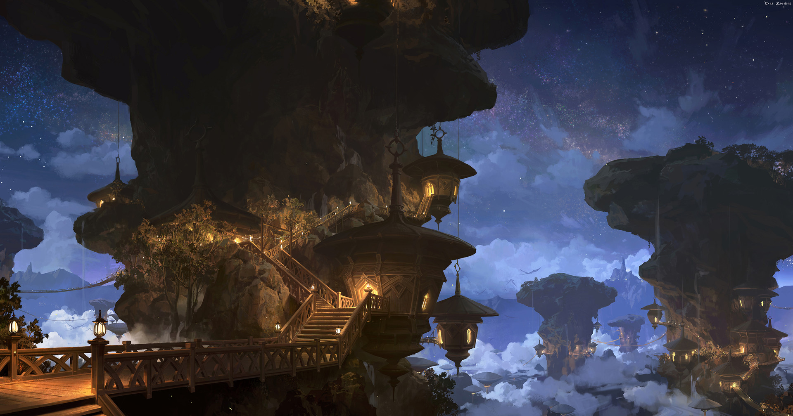

# Ubique

## #100DaysofStory: 008

### Friday, June 21, 2019

---

Visual Inspiration: [Lok Du](https://www.artstation.com/lokdu) - The Quiet Nest

Musical Inspiration: [Jacob Gurevitsch](https://jacobgurevitsch.bandcamp.com/) - [Motivo Loco](https://open.spotify.com/track/6OeryjHXFbVh7Xttk8TOf0)

---

## Ubique

The trees had been his entire world once.

More than that, really. His young years had been spent on or among them. They were the only thing he knew during that time. They'd been his entire universe.

He never considered what was beyond that jagged skyline until he could no longer consider staying. Little did he realize the wealth of opportunity that lay beyond the Clynth Crags.

Although he regretted the circumstances of his departure, he was grateful that it happened the way it did. He may never have left otherwise.

---- ∫ ----

The low clouds were starting to burn off, and glimpses of the turquoise sunset beyond could be seen here and there. He sat on the edge of a large rock outcropping situated underneath the Crags but still high up on the mountainside. From there, he had a panoramic view of almost the entirety of the Cynth Flats.

The Flats were an almost perfectly uniform stretch of grassy shrubland enclosed by an amoeba-shaped ring of jagged mountains. Those mountains were the Cynth Crags. If you didn't know the exact path to take, it was exceptionally easy to get lost among them. Many travelers and even a few of the Flats' locals died among the Crags every season.

The Crags weren't even the most dramatic part about the place, either. As he looked out over the trees, he was struck once again by how extraordinary the trees really were. In his travels across a not insignificant portion of the galaxy, he had seen uncountable sights that had quite literally took his breath away. There was still a certain magic in this valley that he'd found nowhere else.

Maybe it was the fact that many of his firsts had been amongst these trees.

The funny thing was that the trees in question weren't even real trees—though real trees did grow on many of their larger surfaces. As far as he'd experienced or heard, no completely natural tree could grow a kilometer tall. Also as far as he'd heard, these structures _were_ completely natural, and some of them surpassed a kilometer in height.

They were a series of rock formations, almost like massive stalagmites, that grew directly out of the base of the Flats, striking at the sky as if in imitation of their larger brethren, the Crags. The way they were scattered throughout Flats, with the Crags surrounding them, made the whole place look like some world-titan's private garden.

Maybe it was. The legends seemed to think so.

---- ∫ ----

The breeze that ran up the mountains brought the all-too-familiar scent of Clynth to him as he sat on his ledge, contemplating his old home territory.

He had not visited this place—or, come to think of it, even thought about it—in quite a long time. Enough time had passed that he had tangibly changed. At least he wanted to think so.He hoped so. There were reasons he didn't think about this place often.

He began to doubt his decision to return, magic or no.

Over the past half-century, he'd worked through the sensitive parts of the memories many times, each successive analysis allowing him a more objective view as time wore on. After all of this, he felt confident that he could spend time here without any unnecessary and unwanted emotions bubbling up, causing him to do something he'd regret afterwards.

Now that he was here, however, with the sights and smells of the place swirling around him, the doubt grew. The valley didn't seem so welcoming anymore. The breeze grew colder.

_Maybe after all this time—and now that I'm stable—she will..._

_...things would work..._

---- ∫ ----

Feeling despondent, he closed his eyes and removed his supporting arms out from under him, allowing himself to lay down. His spine stretched out over the rough surface of the rocks. The longing he had felt for his home was seemingly long gone.

He opened his eyes and gazed up at the darkening sky, which was mostly devoid of clouds now. Stars were beginning to peak through the envelope of Ubique's atmosphere. Nodes in the galactic graph.

The travel garb he was wearing easily kept his body temperature perfect and provided padding for his back so the rocks did not bruise his spine. The garb was his most advanced—and favorite—piece of equipment.

He'd spent a number of standard decades working as an exotech for a luxury space yacht contractor, a position that also had him working on a few secret military projects. Upon announcing his departure from the company, his team all pitched in to gift the garb to him. He hadn't told them where he was headed next, but the choice of gift gave him some indication that they had guessed.

Returning to his homeworld was not the primary reason he'd left the company, but he knew he should visit before embarking on his next venture. He would be gone, at the very least, a very, _very_ long time. At the most, he would never return.

Excitement began to seep into his body and mind, electrifying his thoughts and sending his imagination soaring into the valley and far beyond. The mere formation of the beginnings of the thought of what he was about to do, and who he was about to do it with, made everything else seem distant—not unimportant or insignificant, just a different order of magnitude on almost every level.

The people he'll be working with and the cause they'll be fighting for were the absolute pinnacle of what he hoped to achieve in his lifetime. For 99.99% of the population, simply crossing the Well would be the journey of a lifetime. For him and his new team, and their new organization, that was only the beginning.

The very beginning.

---- ∫ ----

He smiled and hopped up to his feet, sweeping his gaze across the dark valley. Even without the assistance of the garb's eyepieces, he could make out the shapes of the trees by the lights of those that lived among them.

He sprang from boulder to cliff to boulder, the garb making enormous gaps seem trivial.  His whole body felt as if it were charged with lightning, and it wasn't a stretch to say that it literally _was_.

His imagination continued to bounce and fly with an enthusiasm to match his physical being. He was about to be a part of something supremely important. The effects of his efforts would reach even as far as where he was now, his homeworld Ubique—even situated as it was, tens of thousands of light-years away from where these things were to take place.

For a moment, he wished he could tell his family about it. They would be so proud, and nothing that happened in the past would matter anymore.

The reason for his visit was not to stroke his ego, however. New friends and new ideas were about to take over his life to an even greater extent than since he'd left Ubique. He wanted to be sure that his family knew how grateful he was, and to reassure them he was happy and fulfilled as anyone could ever hope to be.

He wanted to simply be with them during the last moments of free time he'd have in...maybe forever.

---- ∫ ----
