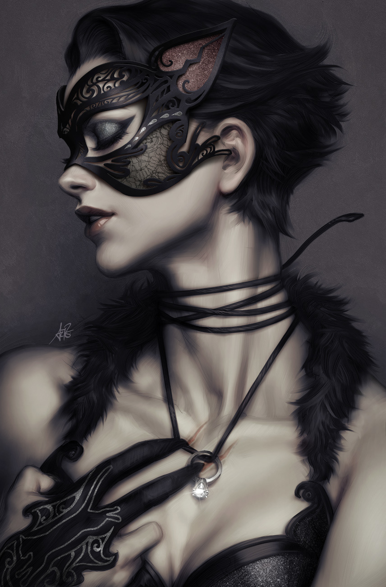

# Bespeak

## #100DaysofStory: 009

### Saturday, June 22, 2019

---

Visual Inspiration: Stanley Argerm Lau - Catwoman

Musical Inspiration: Skeewiff - [Coming Home Baby](https://open.spotify.com/track/4fuEahngW3YAzE4SNkGJcF)

---

## Bespeak

Alia's jet-black hair was short and wavy, curving up and out from her head slightly at the tips. Depending on viewing angle and light—and, though she never told anyone, her mood—her lustrous hair took on a hint of color. On an average day, it shifted between dark blue and deep purple, though depending on her clientele that day, she might cause it to shift into other parts of the spectrum. Some species liked or disliked certain colors, and she was very good at matching their preferences.

Subtle accents were one way she was able to command such a high rate. She'd found that past a certain threshold of wealth, clients would appreciate the fine details and pay handsomely for such an experience, while those just underneath the richest of the rich never seemed capable of noticing such nuance. This also weeded out the clients who would be a bore—she much prefered those who took an interest in more than just her physicality.

As a Symian, it was something of an expectation that she was a professional in these matters. Symians were known galaxy-wide for their expertise in hospitality and other such fields. Alia was the best of the best that the Khaonos system had to offer, and it had _a lot_ to offer.

The Machrobians who ran Khaonos knew they couldn't successfully automate the types of experiences the Symians provided, and had not attempted to do so in case it upset the strong relationships they had built with them and their other organic colleagues. They also knew an important aspect of Khaonos' reputation as the premiere entertainment hub of the galaxy depended on species like the Symians and individuals like Alia. The Machrobian administrators treated her well.

---- ∫ ----

Alia sat in a luxurious viewing box overlooking the final corner of the Mechanine track, a location that she knew cost more than the average Symian made in a decade of working the Khaonosian crowds. It was by no random happenstance that the high-roller that had paid for this box on this particular day had also paid to have Alia there with her.

Months prior to their "chance" meeting, word reached Alia that Serin Sola III, Queen of Solamor, would be spending up to a week in Khaonos. Immediately, Alia knew who would be her next target. This particular queen had been on her list for a decade or more, ever since the last time she'd paid a visit to the Khaonos system.

Alia knew she had to pull out all the stops if she wanted to cross that this one off the list. She also knew that in doing so, she would be potentially putting her entire reputation on the line. No risk, no reward.

Alia took no new clients for months in order to plan and prepare for the Queen's visit. The Queen commanded financial and economic resources on a scale that was impossible for any one being to understand—except for maybe the family of Machrobians that the Sola regime had bred for the job. While the wealth and power qualified the Queen as a potential client, it was the Queen herself—her physical beauty and her intensely shrewd intellect, not to mention her reputation for being something of a sorceress when it came to matters of sex and pleasure—that had made her such a high-value target. 

---- ∫ ----

Alia's plan required that she cash in many years' worth of favors with no real guarantee that any of her efforts would pay off at all. Although the Queen had sexual encounters with females on occasion, they were not her usual affair. As far as Alia was able to ascertain, Serin had yet to do so with a female of a different species—a surprising fact, given the Symians' reputation. It made the challenge all the more interesting.

Alia was one of the very best at her craft, of which the art and science of seduction was a key part. She had to think about this on an atomical—and anatomical—level in order to it to work. Her security would be impenetrable; her mind sharp and critical. The only way it would work is if the Queen came to her.

It was never easy to pull off this type of thing, as everything had to align in such a way that her target would happen to see her at exactly the right moment while in exactly the right state of mind, and had to believe whole-heartedly that the situation was completely coincidental. Alia was astutely aware of the fact that if she overlooked even one of the myriad of seemingly trivial details, her chance with the Queen would be over before it'd even begun.

She wasn't about to let that happen.

---- ∫ ----

The Queen was an avid Mechanine fan that would frequently attend races whenever they happened to be in the vicinity of where she was. Supposedly, a number of systems actually built brand new tracks with the single goal of bringing her and her wealth to their planet. Some people built tracks, some built plans of seduction. Alia's was built around the series of races that were taking place that week on Ophon.

Over the course of the week, Alia made sure the Queen caught quick glimpses of her while she was looking her best. While those evenings were spent with other clients, Alia's display was for the Queen and the Queen alone. That week, everything about Alia was tuned to the Queen's preferences, down to the pheromones, the tint of her hair—even her choice of client.

As the sun fell below the horizon on the final day of the series, Alia's plan came to fruition. The Skein's lightshow to celebrate the first race of the day would be particularly enthralling for the Queen tonight, as Alia had managed to pull the right strings.

While Alia had gone through great pains to keep her plan a secret, and had done as good a job as anyone would hope to do so under the circumstances, there was no getting around the fact that she depended on other people. Unbeknownst to her, her plan attracted the attention of more than just the Queen.

---- ∫ ----
