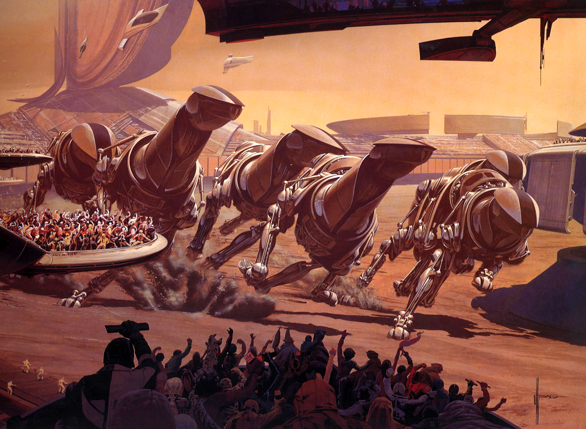

# Beside

## #100DaysofStory: 010

### Sunday, June 23, 2019

---

Visual Inspiration by [Syd Mead](http://sydmead.com/running-of-the-six-drgxx/)

Musical Inspiration: Dusky - [Ingrid is a Hybrid](https://open.spotify.com/track/6hREi7jxcLZyq02dAIsyjL)

---

## Beside

Alia surveyed the room she had just entered, the excitement of the race momentarily forgotten. Much of the room was built around giving the best view to the arrangements of plush seating, each with their own array of amenities. The tables and counters were made from what looked to be real wood, a rarity even in a place like this.

She could not see the Queen at first, because the room was organized into terraces such that those sitting on the lower levels were cleverly hid from view of the top. The major-domo, who had shown her in, had told her where she could find the Queen.

As Alia descended the stairs that ran along the left side of the sloped room, the pack of colossal mechanines had appeared from around the corner of the track, completing the final turn in the course before starting a new lap. The giant four-legged racing bots were mostly grouped together except two which had fallen slightly behind. It was shaping up to be quite an exciting race, though it was rare to experience an unexciting mechanine race on this scale.

The Queen sat at one end of a curved booth built into the bottom row of the terraced room, her eyes fixed on the view beyond the floor-to-ceiling glass of the arena-side wall in front of her.

The reverberations from each powerful step could be felt even on the far side of the two mile-long straightaway. Seeing the action from this angle and distance gave Alia a new sense of why the race was such a popular event.

She stood a few steps back from the lowest terrace, where she wouldn't interrupt the excitement as the mechanines thundered past. She could barely see the back of her quarry's head and shoulders. Months of preparation, work, and dumb luck had led her to this moment, and Alia savored the moment, solidifying the details in memory with the help of a quick shot of Recon from the drug glands located in various spots throughout her body.

This was going to be the one and only chance she had with Queen Serin Sola Mor III. Right now, it didn't matter much that she was the head of the Solamor business and political empire, or even that part of that empire included an entire stellar system that shared her family's name. Alia didn't care about any of the money and power now that she was past the guards.

If anyone could make this happen, it was her.

---- ∫ ----
